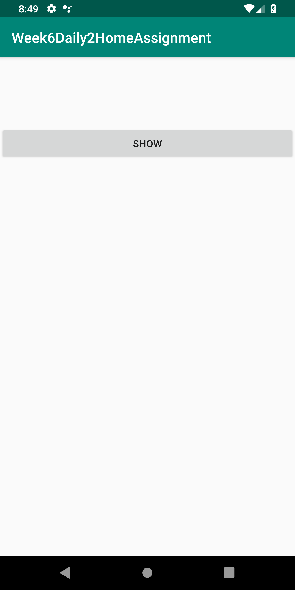
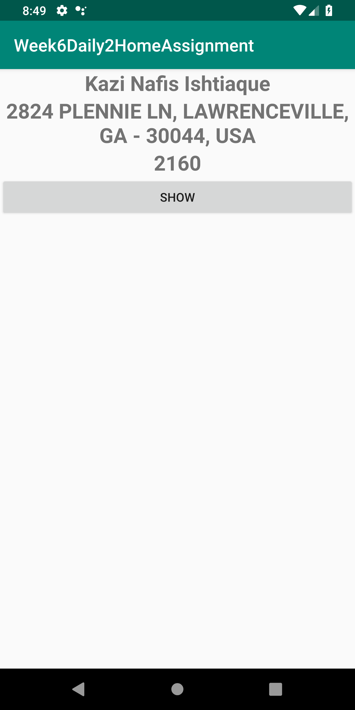
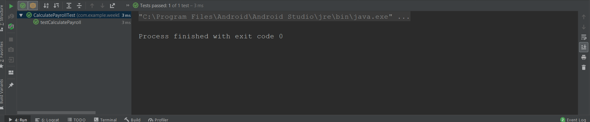
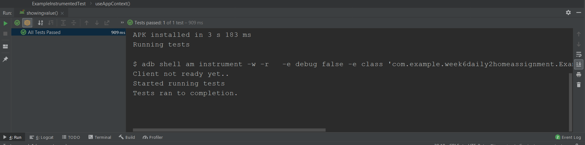
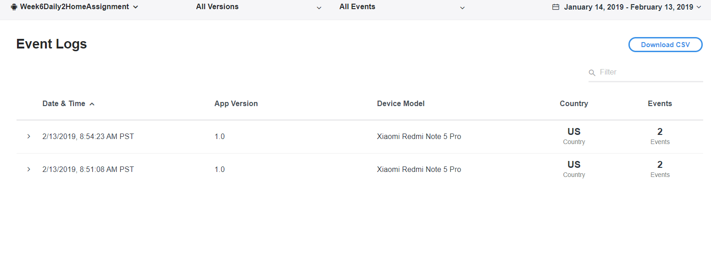

# Week6Daily2HomeAssignment
An android application with Junit test, Expresso Test, firebase analytics &amp; Flurry alalytics.

Going to click the SHOW button.

after clicking, got the data.

Junit testing passed.

Espresso Testing passed.

Firebase analytics.

Flurry Analytics.

